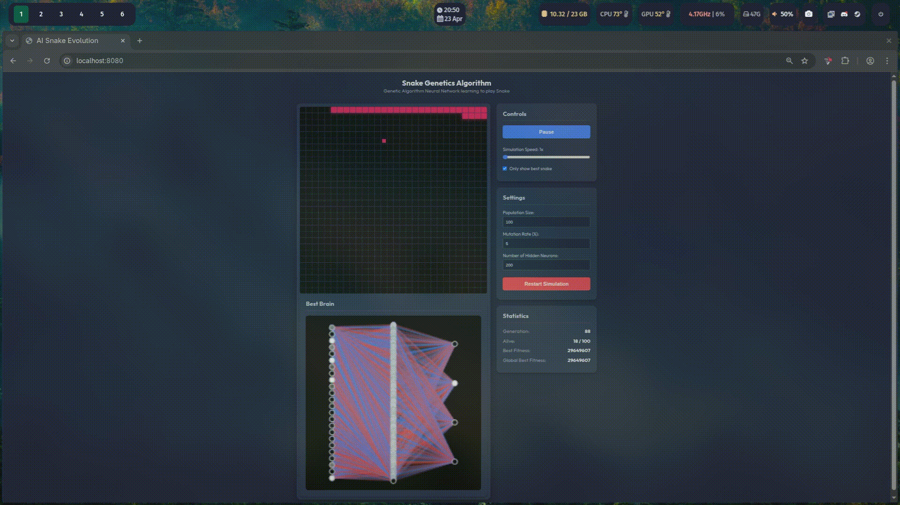

# AI Snake Evolution

**Neural network with Genetics algorithms from scratch.**

[Open in Browser](https://binarymasc.github.io/Snake_GeneticsAlgorithm/)



This repository contains a web-based simulation where an AI learns to play the classic game of Snake. The entire project is built from the ground up using pure vanilla JavaScript, HTML, and CSS, without the use of any external machine learning or AI libraries.

*Note: This code is for research and educational purposes and hasn't a practical application for production environments.*

## Overview

The simulation utilizes a combination of two artificial intelligence concepts:
1. **Feedforward Neural Networks**: The "brain" of each snake. It takes in 24 inputs (vision in 8 directions to detect walls, apples, and its own body) and outputs 4 movement decisions (Up, Down, Left, Right). The entire Matrix math library and network architecture are implemented from scratch.
2. **Genetic Algorithms**: The evolutionary engine. A population of 100 snakes plays the game simultaneously. When they all die, the algorithm calculates their "fitness" (heavily rewarding eating apples and punishing inefficient looping). The best performing snakes are selected to reproduce, crossing over their neural weights and mutating slightly to create the next, smarter generation.

## Features
- **Live Rendering**: Watch the entire population train simultaneously on a single shared canvas, with the current best-performing snake highlighted.
- **Dynamic Parameters**: Adjust the Population Size, Mutation Rate, and Hidden Layer Architecture on-the-fly and restart the simulation.
- **Brain Visualizer**: A live diagram showing the active neural network of the best snake, including its synaptic weights and real-time node activations.

## How to Run
No build tools or installations are required. Simply serve the directory using any local web server and open `index.html` in your browser.

```bash
# Example using Python 3
python3 -m http.server 8080
```
Then navigate to `http://localhost:8080/`.
